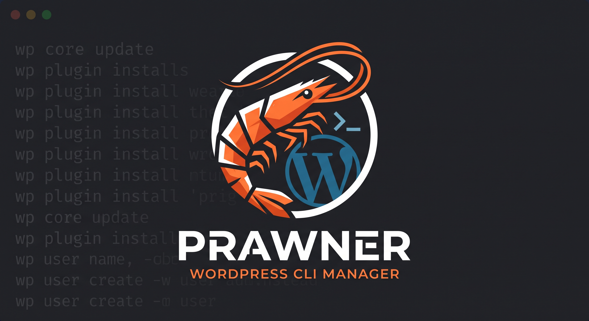

<p align="center">
  
</p>

# prawner

`prawner` is a small set of command line tools to manage several WordPress
sites on a single Linux VPS with an **nginx + PHP-FPM + MySQL + WP-CLI +
certbot** stack:

- **`wp-site.sh`** — provisioning, TLS certificates and safe removal (with a
  backup) of sites, always following the same conventions so that you end up
  with a coherent set of sites that is easy to inspect.
- **`wp-update.sh`** — automatic daily updates of core, plugins and themes on
  every site, with a backup and an automatic rollback if something breaks.
- **`wp-media-clean.sh`** — reclaims disk space by moving unused media into a
  reversible quarantine: attachments nothing references any more, files under
  `uploads/` that belong to no attachment, and thumbnails for image sizes the
  theme no longer registers.

## wp-site.sh — site provisioning

- **`list`** — summary table of every site configured in nginx: domain,
  docroot, owner, whether the vhost is enabled, days left before the TLS
  certificate expires. It also reports docroots without a matching vhost.
- **`create <domain>`** — creates a new site from scratch:
  dedicated system user, MySQL database, WordPress download and install via
  WP-CLI, correct filesystem permissions, nginx vhost with basic hardening,
  upfront DNS check.
- **`cert <domain>`** — requests the TLS certificate with certbot (nginx
  plugin), verifies that DNS points to the server before proceeding, and
  aligns WordPress `home`/`siteurl` with the https URL.
- **`remove <domain>`** — removes a site in a guided way: it first takes a
  full backup (database dump, file archive, vhost, credentials) in
  `/var/backups/wp-site`, then asks for explicit confirmation by typing the
  domain name, and only then tears down vhost, database, certificate and files.

## Conventions

| What             | Path / value                                         |
|------------------|------------------------------------------------------|
| Docroot          | `/var/www/<domain>/wordpress/`                       |
| Vhost            | `/etc/nginx/sites-available/<slug>` (no extension)   |
| Enable           | symlink in `/etc/nginx/sites-enabled/`               |
| PHP-FPM          | `unix:/run/php/php8.1-fpm.sock` (pool `www-data`)    |
| TLS              | `certbot --nginx`, rewrites the vhost adding `:443`  |
| Credentials      | saved in `/root/wp-sites/<domain>.txt` (mode 600)    |
| Backup           | `/var/backups/wp-site/<domain>-<timestamp>/`         |
| Media quarantine | `/var/backups/wp-media/<site>/<stamp>/`              |

## Requirements

The tool assumes a VPS that is already set up with:

- Linux with `bash`, run **as root** (or via `sudo`)
- `nginx`
- PHP-FPM listening on a unix socket (default `php8.1-fpm`)
- MySQL/MariaDB reachable with the `mysql` client (root credentials already
  available, e.g. via `~/.my.cnf` or socket auth)
- [`wp-cli`](https://wp-cli.org/) installed and in the `PATH`
- [`certbot`](https://certbot.eff.org/) with the nginx plugin
  (`apt install certbot python3-certbot-nginx`)
- `openssl`, `curl`, `getent`, the basic coreutils tools
- `wp-media-clean.sh` additionally requires `find`, `stat` and `mysqldump` (it
  refuses to run without any of them, alongside `wp`, `mysql`, `grep`, `sed`,
  `awk`, `sort` and `sudo` already covered above). `mysqldump` is the one that
  is easy to miss: `wp db export` shells out to it, so without it every row
  dump comes back empty, the safety gate refuses, and the whole attachments
  class is silently skipped on every run. `numfmt` is used for human-readable
  byte totals in its report but is optional — without it the report prints raw
  byte counts instead

The domain DNS must already point to the public IP of the VPS before running
`create` or `cert`: both commands check the resolution and warn (or stop) if
it does not match.

## Installation

```bash
git clone https://github.com/simonecosci/prawner.git
cd prawner
sudo ./install.sh
```

This copies `bin/wp-site.sh`, `bin/wp-update.sh` and `bin/wp-media-clean.sh`
into `/usr/local/bin/` and reports any missing dependencies. To install the
daily `wp-update.sh` cron job at the same time:

```bash
sudo ./install.sh --with-cron
```

To uninstall (add `--with-cron` to remove the cron job as well):

```bash
sudo ./uninstall.sh [--with-cron]
```

To use the commands without installing them, just run them from the repo:

```bash
sudo ./bin/wp-site.sh list
sudo ./bin/wp-update.sh --dry-run
sudo ./bin/wp-media-clean.sh --site example.com
```

## Usage — wp-site.sh

```bash
wp-site.sh list

wp-site.sh create example.com --admin-email admin@example.com
wp-site.sh create example.com --owner example_com --no-www --admin-email admin@example.com

wp-site.sh cert example.com
wp-site.sh cert example.com --no-www

wp-site.sh remove example.com
```

### `create` options

| Option                 | Description                                              |
|------------------------|----------------------------------------------------------|
| `--owner <user>`       | System user owning the files (default `www-data`, created if missing) |
| `--no-www`             | Does not include `www.<domain>` in the vhost / certificate |
| `--admin-email <mail>` | WordPress administrator email (required, or via `ADMIN_EMAIL`) |

### Environment variables

Every convention can be overridden to fit different setups:

| Variable            | Default                                   |
|---------------------|-------------------------------------------|
| `NGINX_AVAIL`        | `/etc/nginx/sites-available`             |
| `NGINX_ENABLED`      | `/etc/nginx/sites-enabled`               |
| `WWW_ROOT`           | `/var/www`                               |
| `PHP_SOCK`           | `/run/php/php8.1-fpm.sock`               |
| `BACKUP_ROOT`        | `/var/backups/wp-site`                   |
| `WP_CLI_CACHE_ROOT`  | `/var/cache/wp-cli`                      |
| `DEFAULT_OWNER`      | `www-data`                               |
| `WP_LOCALE`          | `en_US` — locale of the WordPress installed by `create` |
| `ADMIN_EMAIL`        | *(empty)* — default admin email for `create`/`cert` |

## wp-update.sh — automatic updates

`wp-update.sh` scans `$WWW_ROOT` looking for every real WordPress installation
(every `wp-config.php` found, not just `<domain>/wordpress`) and for each one:

1. takes a backup (DB dump + tar of `wp-content/{plugins,themes,mu-plugins}`,
   `uploads` excluded) in `$BACKUP_ROOT/<site>/<timestamp>/`;
2. updates core → plugins → themes → DB schema;
3. runs an HTTP smoke test (home page + `wp-login.php`, checking the response
   for PHP/DB errors);
4. if the smoke test fails, performs an **automatic rollback** from the backup
   just taken (core, `wp-content`, database) and retries the smoke test.

The "canary" sites (paths containing `test`, e.g. `wordpress-test`) are updated
first, so that a problem shows up there before production sites are touched.

```bash
wp-update.sh                   # update everything
wp-update.sh --dry-run         # only show what would be updated
wp-update.sh --site example.com   # a single site (partial match on the path)
wp-update.sh --no-core         # plugins and themes only
wp-update.sh --skip-smoke      # skip the smoke test and the rollback
```

The exit code is non-zero if at least one site had problems — handy for cron
monitoring.

### Environment variables

| Variable            | Default             |
|---------------------|---------------------|
| `WWW_ROOT`           | `/var/www`          |
| `BACKUP_ROOT`        | `/var/backups/wp`   |
| `LOG_DIR`            | `/var/log/wp-update` |
| `KEEP_BACKUPS`       | `3` (backup sets kept per site) |
| `MIN_FREE_MB`        | `1024` (minimum space required on `BACKUP_ROOT`) |
| `CURL_TIMEOUT`       | `30` (seconds, for the smoke test) |
| `WP_CLI_CACHE_ROOT`  | `/var/cache/wp-cli`  |

### Daily cron

The easiest way is to install it together with the commands:

```bash
sudo ./install.sh --with-cron
```

Alternatively, by hand:

```bash
sudo cp cron.d/wp-update /etc/cron.d/wp-update
sudo chmod 644 /etc/cron.d/wp-update
sudo chown root:root /etc/cron.d/wp-update
```

The [`cron.d/wp-update`](cron.d/wp-update) file runs `wp-update.sh` every day
at 03:30 as root, with `flock` to avoid overlapping runs if a previous update
is still in progress:

```cron
30 3 * * * root flock -n /run/wp-update.lock /usr/local/bin/wp-update.sh >> /var/log/wp-update/cron.log 2>&1
```

Logs:

- `/var/log/wp-update/cron.log` — output of the last cron run
- `/var/log/wp-update/<timestamp>.log` — detailed log of each single run

## wp-media-clean.sh — media cleanup

Reports, by default. It only moves something when `--apply` is given, and even
then nothing is deleted: files go to `/var/backups/wp-media/<site>/<stamp>/`
together with a dump of the affected database rows, and `--restore` puts them
back. Real deletion happens only when a set falls out of the `KEEP_QUARANTINE`
retention window (three sets per site).

### Before you run `--apply` on a real site

This tool was built and reviewed without a WordPress installation, MySQL,
wp-cli, `sudo` or `/var/www` to test against: every check below could only be
verified with unit tests over pure string logic and hand-built fixtures that
stub `wp_run`, `chown` and `stat`, never against a real site. None of it is a
substitute for looking at real data.

Four automated suites cover what could be tested without a real site, and you
can run all of them right now, with no WordPress needed:

- `tests/run.sh` — 30 assertions over the pure string helpers (filename
  parsing, upload variants, URL encoding, reference-token extraction). No
  WordPress, no database.
- `tests/classify.sh` — 106 assertions over `classify()` and the collectors:
  the classification rules themselves (upload variants, registered and
  deregistered sizes, a file shared by two size names, the excluded
  directories, the age cutoff, references by name and by ID) and the guards
  that stop a collector which failed from being read as "the answer is
  nothing". Real temporary uploads trees, `wp_run` stubbed.
- `tests/quarantine.sh` — 77 assertions over `quarantine_site()`: the row-dump
  gate, a failed move blocking the row deletion, the per-attachment gate on
  the metadata edit, and the counting and exit status that keep a run which
  did not do what it claims from reporting success.
- `tests/restore.sh` — 102 assertions over `restore_site`, against temporary
  fixture trees with `chown`, `stat` and `wp_run` stubbed. Also no WordPress
  or database.

All four are standalone:

```bash
bash tests/run.sh
bash tests/classify.sh
bash tests/quarantine.sh
bash tests/restore.sh
```

Everything below is what those four suites cannot cover — real wp-cli output,
real classification decisions on real data, real files. Work through this
checklist on a real VPS — a test site, not production — before trusting
`--apply` with data you care about.

**wp-cli assumptions the collectors depend on:**

- [ ] the real `wp_run` shape works, not just the short one. Every command in
      this checklist is written as `sudo -u <owner> wp --path=<path> ...`, but
      what the script actually runs is
      `sudo -u <owner> env WP_CLI_CACHE_DIR=/var/cache/wp-cli/<owner> HOME=/tmp wp --path=<path> ...`
      — those two variables exist for sites owned by `www-data` or by an ftp
      user with a non-writable `HOME`, which is exactly the case that breaks,
      and they have never been executed on a real machine. Run one harmless
      command in that full form (`... db query "SELECT 1" --skip-column-names`)
      and confirm it behaves identically to the short one.
- [ ] `mysqldump` is on the PATH (`command -v mysqldump`). `wp db export`
      shells out to it, and without it the row dumps come back empty and the
      whole attachments class is skipped every run.
- [ ] `wp eval` runs at all, and `collect_size_map`'s eval in particular. It is
      the only PHP the script runs, it is used both for
      `wp_get_upload_dir()` and for the size map, and it is the collector most
      likely to fall over on a large real library. Run the eval from
      `collect_size_map` by hand (copy it out of the script) and confirm it
      emits one TSV row per generated size, four tab-separated fields each
      (attachment ID, size name, filename, the attachment's subdirectory),
      followed by a final `__SIZEMAP_COMPLETE__` line. Check the row count is
      plausible: roughly the number of image attachments multiplied by the
      number of registered sizes.
- [ ] `wp db query ... --skip-column-names` actually suppresses the header row
      (every collector query relies on this to avoid a stray column-name line
      in its output):
      `sudo -u <owner> wp --path=<path> db query "SELECT 1" --skip-column-names`
      should print a bare `1`, nothing else.
- [ ] `wp media image-size --format=csv` prints one registered size per row,
      name in the first column (`collect_registered_sizes` reads it that way):
      `sudo -u <owner> wp --path=<path> media image-size --format=csv` should
      show a header row followed by `thumbnail`, `medium`, `large` and any
      custom sizes as the first field of each row.
- [ ] `wp db export - --where=... --no-create-info --skip-add-drop-table`
      passes `--where` through to `mysqldump` and omits the `CREATE TABLE`
      statement (`quarantine_site` dumps the rows it is about to delete this
      way, before deleting anything):
      `sudo -u <owner> wp --path=<path> db export - --tables=<prefix>posts --where="ID=1" --no-create-info --skip-add-drop-table | head`
      should show only `INSERT INTO` statements, no `CREATE TABLE`.

**Collector sanity, on the report only, no `--apply`:**

- [ ] the attachment inventory count in the log roughly matches the count
      shown in wp-admin → Media.
- [ ] the registered size list includes `thumbnail`, `medium` and `large`.
- [ ] the ID set is non-empty on any site that uses featured images. An empty
      haystack or an empty inventory is a bug, not a clean site — stop and
      investigate rather than proceeding to `--apply`.
- [ ] the size map is neither empty nor much shorter than the eval above led
      you to expect. If it is, **stop**: the thumbs class reads it as "no
      generated size belongs to any attachment", and every thumbnail on the
      site then looks like a leftover. The script refuses the class outright
      when the map is empty or its completion marker is missing, and says so
      in the log — but a map that is merely *short* for some other reason is
      still yours to catch here.

**Classification, before `--apply` is ever used:**

- [ ] pick one file from the report's "stale thumbs" list and confirm with
      `grep -c "$(basename FILE)"` over the site's `post_content` that nothing
      references it.
- [ ] confirm the site's logo, favicon and a WooCommerce product gallery image
      are **not** listed under "attachments".
- [ ] confirm a `-scaled.jpg` upload and its untouched original appear in
      neither list.
- [ ] confirm an image used only in a draft post appears in neither list.

If any of those four appears where it shouldn't, stop and fix the
classification before going near `--apply`.

**Quarantine and retention, on a test site only — never production on the
first run:**

- [ ] `wp-media-clean.sh --site <test-domain>` (report), then
      `wp-media-clean.sh --site <test-domain> --apply`. Check the exit status
      of the `--apply` run (`echo $?`): a run in which the dump gate refused,
      or a move failed, or a row deletion failed, now exits non-zero and says
      what did not happen. Zero means every class did what the report said it
      would.
- [ ] `/var/backups/wp-media/<site>/<stamp>/` contains `files/`,
      `manifest.tsv`, and non-empty `rows/posts.sql` and `rows/postmeta.sql`.
- [ ] the removed attachments no longer appear in wp-admin.
- [ ] the home page and a post that used one of the removed images still
      render correctly.
- [ ] run `--apply` four times in a row and confirm only three quarantine sets
      survive (the `KEEP_QUARANTINE` retention window).

**Restore:**

- [ ] `--list-quarantine --site <test-domain>` shows the set with its item
      count and size.
- [ ] `--restore <stamp> --site <test-domain>` puts every file back, reimports
      the database rows, and the previously removed attachments are visible
      again in wp-admin with working thumbnails.
- [ ] `ls -l` one of the restored files and confirm its owner and group are
      the site's, not `root`. wp-admin showing the image proves nothing about
      ownership: the web server can read a root-owned file perfectly well and
      only fails later, on the first upload or update that needs to write
      into that directory.
- [ ] run the same `--restore` a second time: already-restored files are
      recognised as such (not reported as conflicts) and only get their
      ownership reapplied; the rows get imported again too, and a duplicate-key
      failure at that point is an expected, safe outcome, not data loss —
      confirm nothing is corrupted either way.
- [ ] force a quarantine set into the manifest-less state (remove
      `manifest.tsv` from a set that still has `rows/`) and confirm `--restore`
      still imports the rows instead of refusing.
- [ ] confirm no `wp media regenerate` call is ever made during a restore — it
      would strip metadata for sizes no longer registered, undoing exactly
      what the restore just put back.

```bash
wp-media-clean.sh                                   # report every site
wp-media-clean.sh --site example.com                # report one site
wp-media-clean.sh --site example.com --apply        # move to quarantine
wp-media-clean.sh --only thumbs --apply             # one class only
wp-media-clean.sh --list-quarantine --site example.com
wp-media-clean.sh --restore 20260908-143000 --site example.com
```

An image counts as used when its filename appears anywhere in the database —
post content, custom fields, options, term and user meta, including drafts,
revisions, scheduled posts and the trash — or in the theme and plugin files, or
when its attachment ID appears as a reference (featured image, ACF field,
WooCommerce gallery). Both tests err towards keeping the file: the
classification is deliberately biased so that an uncertain file is kept, never
removed.

Attachments uploaded in the last 30 days are skipped, so that images not yet
inserted anywhere survive. Change it with `--min-age`.

Read the report before running `--apply` the first time on a site. Images
referenced only from outside WordPress — a CDN manifest, another site
hotlinking — are invisible to the tool, which is why removal is a quarantine
and not a delete.

### Environment variables

| Variable              | Default                            |
|------------------------|------------------------------------|
| `WWW_ROOT`             | `/var/www`                         |
| `QUARANTINE_ROOT`      | `/var/backups/wp-media`            |
| `LOG_DIR`              | `/var/log/wp-media-clean`          |
| `WP_CLI_CACHE_ROOT`    | `/var/cache/wp-cli`                |
| `KEEP_QUARANTINE`      | `3` (quarantine sets kept per site) |
| `MIN_AGE_DAYS`         | `30` (same as `--min-age`)          |
| `EXCLUDE_UPLOAD_DIRS`  | `woocommerce_uploads wpforms backups wp-personal-data-exports elementor cache` — directory names under `uploads/`, at any depth, that the orphan-file scan skips |

## Security

The vhost generated by `create` already includes:

- PHP execution blocked inside `wp-content/uploads/`
- deny on `wp-config.php`, `xmlrpc.php`, dotfiles and `readme.html`/`license.txt`
- `DISALLOW_FILE_EDIT` and automatic minor updates in `wp-config.php`
- removal of the default plugins/content (`hello`, `akismet`, sample post)
- randomly generated database and admin passwords, saved only in
  `/root/wp-sites/<domain>.txt` (never in the docroot)

The script always requires being run as root: it manipulates `/etc/nginx`,
creates/drops MySQL databases and manages system users, so it should only be
run on VPSes you fully control.

## License

[MIT](LICENSE)
